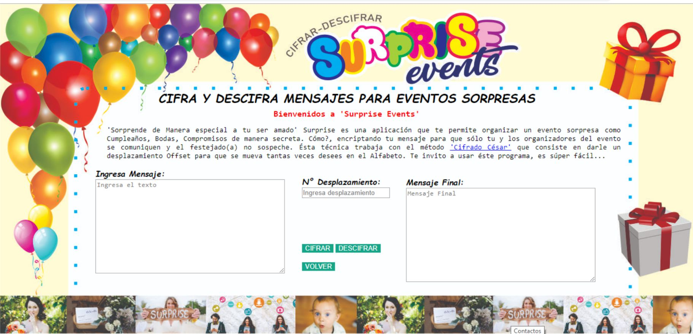

# CIFRAR-DESCIFRAR SURPRISE EVENTS

Suprise Events es una herramienta que permite "CIFRAR y/o DESCIFRAR" cualquier mensaje que trabaje con las letras del Alfabeto Latino
"ABCDEFGHIJKLMNOPQRSTUVWXYZ" exceptuando las letra 'Ñ' y con un Offset que es el N° de desplazamiento que le damos para CODIFICAR o DECODIFICAR el mensaje.

Está basado en el "Cifrado César" => En criptografía, el cifrado César, también conocido como cifrado por desplazamiento, código de César o desplazamiento de César, es una de las técnicas de cifrado más simples y más usadas. Es un tipo de cifrado por sustitución en el que una letra en el texto original es reemplazada por otra letra que se encuentra un número fijo de posiciones más adelante en el alfabeto. Por ejemplo, con un desplazamiento de 3, la A sería sustituida por la D (situada 3 lugares a la derecha de la A), la B sería reemplazada por la E, etc. Este método debe su nombre a Julio César, que lo usaba para comunicarse con sus generales.

Por ejemplo, si usamos un desplazamiento (_offset_) de 3 posiciones:

- La letra A se cifra como D.
- La palabra CASA se cifra como FDVD.
- Alfabeto sin cifrar: A B C D E F G H I J K L M N O P Q R S T U V W X Y Z
- Alfabeto cifrado: D E F G H I J K L M N O P Q R S T U V W X Y Z A B C

## Resumen del proyecto
## ESTRUCTURA DEL PROYECTO

El proyecto consiste en cifrar y descifrar un texto indicando un desplazamiento específico de caracteres llamado Offset.

PASOS:

1.-El usuario ingresa su Mensaje.
2.-Ingresa N° de Desplazamiento deseado (sólo debe ingresar numeros positivos enteros), a éste número se llamará Offset.
3.-Escoge opción "CIFRAR ó DESCIFRAR"
4.-Obtiene el Mensaje Final
5.-Puede ingresar nuevamente mensaje mediante la opción "VOLVER".

Por Ejemplo

Ingresamos "HOLA" en mayúscula con un Offset de 2, escogemos "CIFRAR" el mensaje final retorna "JQNC".

## A QUE TIPO DE USUARIOS VA DIRIGIDO

Si planificar un evento es complicado, una fiesta sorpresa resulta doblemente retadora. Una celebración de esta índole puede ser una buena idea, pero nunca falta quien, por error, le diga a la persona y se traiga la sorpresa abajo.

La pregunta esencial en estos casos es: ¿Cómo organizar una fiesta sorpresa para que esa persona no se entere?, de ésta manera nace la idea de realizar  una herramienta donde se pueda comunicar de manera secreta, rápida y sencilla los organizadores del evento, que en éste caso van a ser los complices.

Surprise Events va dirigido a personas que deseen realizar un evento sorpresa, desde niños, jóvenes y adultos. Eventos como: Cumpleaños, Cenas, Compromisos, Reencuentros o simplemente cuando quieras dar una gran sorpresa planificada.

## OBJETIVO DEL PRODUCTO

Por medio de ésta herramienta se pueden enviar mensajes entre el círculo de personas complices de la sorpresa.
Pueden compartir, organizar, invitar, planificar, idear el evento de manera escondida y sorprender al agasajado de una  muy forma original.

Excelente herramienta que podrás usar en cualquier momento de tu vida. Anímate y prueba este grandioso instrumento para planificar la sorpresa a esa persona tan especial.

 

TECNOLOGÍAS USADAS

* Trello-
* Visual Studio Code
* Javascript
* HTML
* CSS

